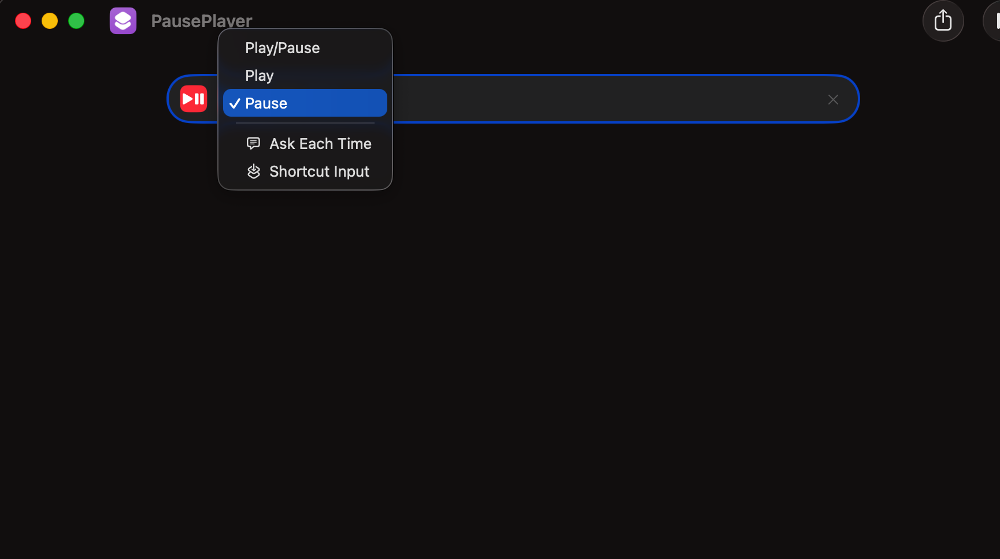

# Stop Play

Raycast command to start a media-stop timer and manage active timers in one place.

## Required setup (Shortcuts)

Before using the command, create a macOS Shortcut that pauses playback:

1. Open the **Shortcuts** app.
2. Create a new shortcut named `PausePlayer`.
3. Search for **Pause** in actions.
4. Select the **Pause** action from the dropdown.
5. Save the shortcut.



The command runs:

- `shortcuts run "PausePlayer"`
- `pmset displaysleepnow`

If `PausePlayer` is missing, the timer process will not pause media correctly.

## Required setup (`sudo` / `pmset`)

Timers run `sudo pmset` in the background so display sleep and sleep locks behave as intended. That only works end-to-end if macOS does not stop to ask for your password (there is no fingerprint/password prompt for detached shells).

To allow **`pmset` only** without a password:

1. Find your macOS account **short name** (login name). In Terminal run:

   ```bash
   whoami
   ```

   Or open **System Settings → Users & Groups**, select your user, and note the name shown there (not the full display name).

2. Edit the sudoers file safely:

   ```bash
   sudo visudo
   ```

3. Locate the line that looks exactly like this (do not change it):

   ```
   %admin ALL=(ALL) ALL
   ```

4. **Immediately after that line**, add a new line. Replace `your_short_name` with the name from step 1. Type it exactly—spacing and path matter (NOPASSWD must match the real binary; on Apple silicon and Intel macOS it is almost always `/usr/sbin/pmset`). Confirm with `which pmset` if unsure:

   ```
   your_short_name ALL=(ALL) NOPASSWD: /usr/sbin/pmset
   ```

   Example (if `whoami` prints `alex`):

   ```
   alex ALL=(ALL) NOPASSWD: /usr/sbin/pmset
   ```

5. Save and quit the editor (`visudo` will refuse to save if the syntax is wrong).

Wrong edits to sudoers can lock you out of `sudo`; if unsure, fix mistakes inside `visudo` before saving. This rule grants passwordless `sudo` **only** for `/usr/bin/pmset`, not for other commands.

## Usage

1. Open Raycast command: `Stop Play After "X" Min`.
2. Start a preset timer or use **Start Custom** with hours/minutes/seconds.
3. Manage running timers from the **Active Timers** section (refresh or stop).

## Notes

- Starting a timer from the main list closes Raycast after success; using **Start Custom** returns you to the list after submit.
- Recent durations are saved as suggestions for next time.
- This extension is intended for macOS because it uses Shortcuts and `pmset`.
